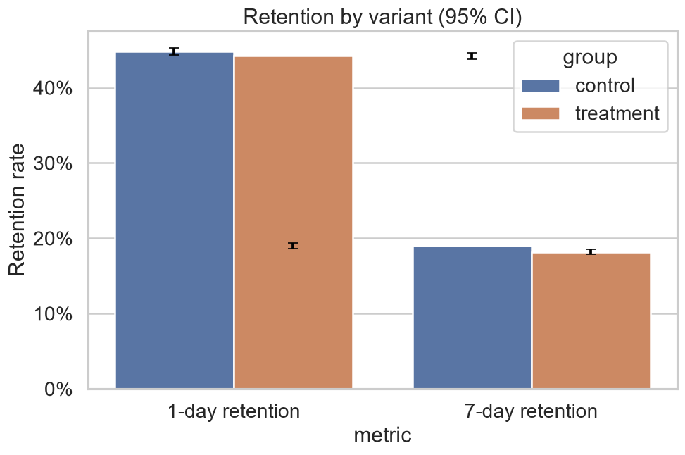
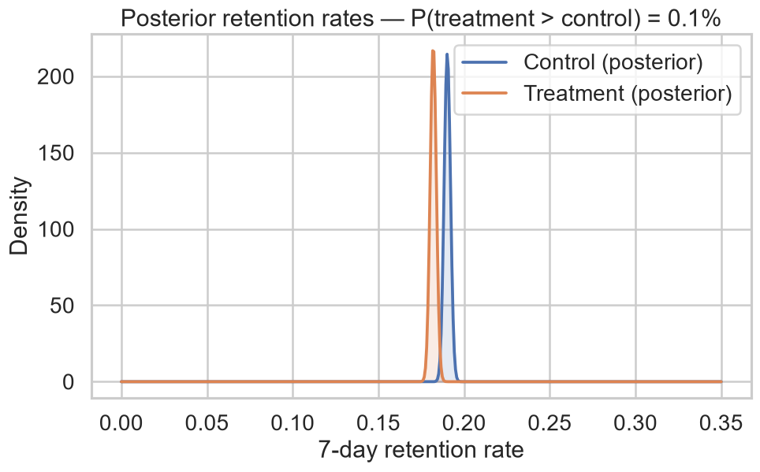
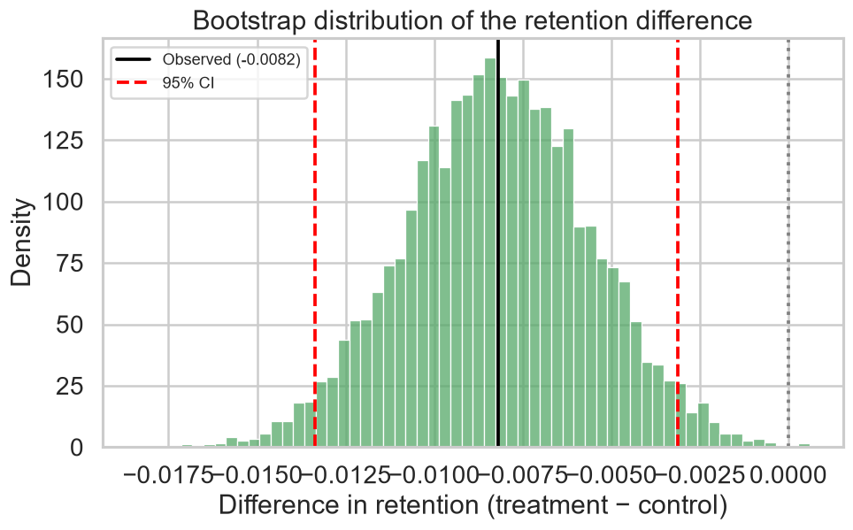
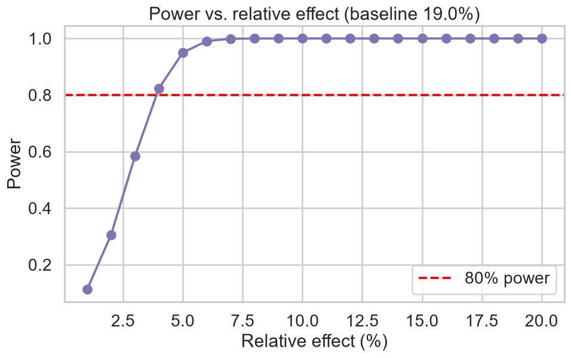

# A/B Testing — Cookie Cats 🧪

**A complete experimentation workflow**: hypothesis & power, randomisation health checks,
frequentist + bootstrap + Bayesian inference, and a clear ship / no-ship decision.


---

## 📌 The experiment

A match-3 mobile game moved its **gate** from level 30 (`gate_30`, control) to level 40
(`gate_40`, treatment). Does the new gate placement change player retention?

| | |
|---|---|
| **Primary metric** | 7-day retention (`retention_7`) |
| **Secondary metrics** | 1-day retention, games played (`sum_gamerounds`) |
| **Design** | two-sided, α = 0.05, target power = 0.80 |
| **Data** | 90,189 players (44,700 control / 45,489 treatment) |

**Hypotheses**

- **H₀** — 7-day retention is the same for `gate_30` and `gate_40`.
- **H₁** — 7-day retention differs between the two variants.

## 🏁 Result: **Do not ship `gate_40`**

| Quantity | Value |
|---|---:|
| Control 7-day retention | **19.02%** |
| Treatment 7-day retention | **18.20%** |
| Absolute difference | **−0.82 pp** |
| Relative lift | **−4.31%** |
| 95% CI (difference) | [−1.33 pp, −0.31 pp] |
| p-value (z-test) | **0.0016** |
| P(treatment > control) | **0.08%** |
| SRM detected | No |

Moving the gate to level 40 **significantly reduces** 7-day retention. Both frequentist
and Bayesian analyses agree, so the recommendation is to **keep `gate_30`**.

## 🗂️ Project structure

```
ab-testing/
├── config/config.yaml
├── src/abtest/
│   ├── data.py           # download / load / split
│   ├── design.py         # hypotheses, sample size, MDE, power curve
│   ├── sanity.py         # SRM, balance, outliers
│   ├── stats_tests.py    # z-test, chi-square, Fisher, bootstrap, Mann-Whitney
│   ├── bayesian.py       # Beta-Binomial posteriors
│   ├── plots.py          # 6 figures
│   ├── report.py         # markdown report
│   └── pipeline.py
├── run.py                # ← entry point
├── tests/test_smoke.py
└── reports/              # figures + tables + REPORT.md
```

## 🚀 Quickstart

```bash
pip install -r requirements.txt
python run.py
python -m pytest -q
```

## 🔬 What makes this rigorous

1. **Design first** — we compute the required sample size for a 2% relative MDE and the
   smallest effect this test could detect.
2. **Sanity checks** — sample-ratio mismatch (χ², α = 0.001), covariate balance and the
   famous single-user outlier (49,854 rounds).
3. **Multiple methods** — the primary z-test is cross-checked with χ², Fisher's exact,
   a **bootstrap** distribution and a **Bayesian** Beta-Binomial model.
4. **Effect sizes, not just p-values** — Cohen's h for rates, Cliff's delta and bootstrap CIs
   for the heavy-tailed games-played metric.
5. **A decision** — combining significance, Bayesian probability of superiority and SRM into
   an explicit ship / no-ship call.

### Figures

| | |
|---|---|
|  |  |
|  |  |

## 📊 Dataset

**Mobile Games A/B Testing — Cookie Cats** (Kaggle), mirrored on GitHub at
[`ryanschaub/Mobile-Games-A-B-Testing-with-Cookie-Cats`](https://github.com/ryanschaub/Mobile-Games-A-B-Testing-with-Cookie-Cats).
Downloaded automatically on first run.

## 🧰 Tech stack

`Python` · `pandas` · `numpy` · `scipy` · `statsmodels` · `matplotlib` · `seaborn` · `pytest`

## 📄 License

MIT — see [LICENSE](LICENSE).
