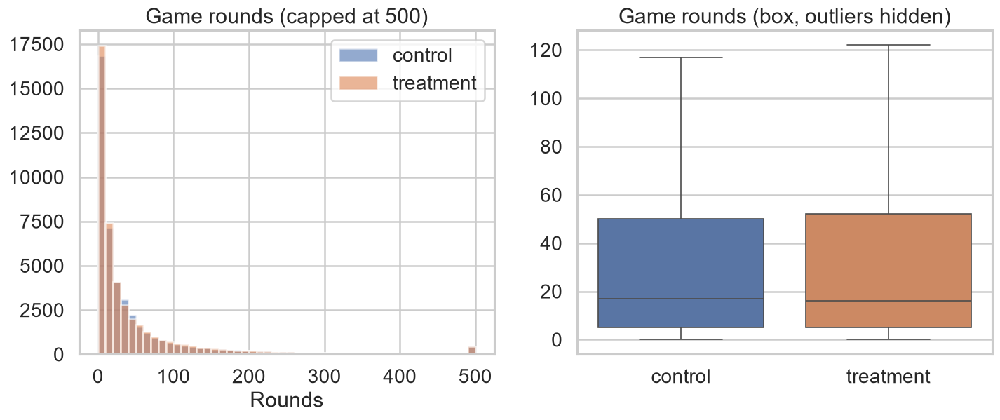

# A/B Test Analysis — Automated Report

> Cookie Cats gate placement experiment (`gate_30` vs `gate_40`).
> Generated by `python run.py`; figures in `reports/figures/`.

## 🏁 Decision: **Do not ship gate_40**

The primary metric is significantly worse in the treatment group.

## 1. Hypothesis & design

| Item | Value |
| --- | --- |
| Primary metric | retention_7 |
| Control | gate_30 |
| Treatment | gate_40 |
| H0 | The retention_7 rate is identical for gate_30 and gate_40. |
| H1 | The retention_7 rate differs between gate_30 and gate_40 (two-sided). |
| alpha | 0.05 |
| target power | 0.80 |
| Baseline rate | 19.02% |
| Sample size / group | 168,357 |
| Detectable relative MDE | 3.88% |

**Sample-size calculation** — to detect a 2.0% relative change on a baseline of 19.02% at α=0.05 and power=0.80, we would need **168,357 users per group**.

## 2. Randomisation health checks

| total | n_gate_30 | n_gate_40 | observed_ratio | expected_ratio | chi2 | p_value | alpha | srm_detected |
| --- | --- | --- | --- | --- | --- | --- | --- | --- |
| 90189 | 44700 | 45489 | 0.5043741476233243 | 0.5 | 6.9024049496058275 | 0.008607987810836262 | 0.001 | False |

**SRM detected:** False (observed split 49.563% / 50.437%).

Covariate balance:

| metric | overall_mean | mean_gate_30 | mean_gate_40 |
| --- | --- | --- | --- |
| retention_7 | 18.6065% | 19.0201% | 18.2000% |
| retention_1 | 44.5210% | 44.8188% | 44.2283% |
| sum_gamerounds | 5187.2457% | 5245.6264% | 5129.8776% |

Outliers above 49,000 rounds: **1** user(s).

## 3. Primary metric — 7-day retention

| Quantity | Value |
| --- | --- |
| Control rate | 19.0201% |
| Treatment rate | 18.2000% |
| Absolute difference | -0.8201% |
| Relative lift | -4.31% |
| 95% CI (difference) | [-1.3282%, -0.3121%] |
| z-statistic | -3.164 |
| p-value (two-sided) | 0.0016 |
| p-value (chi-square) | 0.0016 |
| p-value (Fisher exact) | 0.0016 |
| Cohen's h | -0.0211 |
| Statistically significant | True |

Bootstrap 95% CI: [-1.3356%, -0.3111%] with bootstrap p-value **0.0014**.

## 4. Bayesian view

| Quantity | Value |
| --- | --- |
| Posterior mean (control) | 19.0215% |
| Posterior mean (treatment) | 18.2014% |
| P(treatment > control) | 0.08% |
| Expected relative uplift | -4.30% |
| 95% credible interval (rel.) | [-6.89%, -1.65%] |
| Expected loss if we ship treatment | 0.00819 |

## 5. Secondary metrics

**1-day retention**

| p_control | p_treatment | absolute_diff | relative_lift_pct | p_value | significant |
| --- | --- | --- | --- | --- | --- |
| 0.4481879194630872 | 0.44228274967574577 | -0.005905169787341458 | -1.317565585974659 | 0.07440965529691912 | False |

**Game rounds** (non-parametric + bootstrap):

| u_stat | p_value | cliffs_delta | median_control | median_treatment | mean_control | mean_treatment | ci_low | ci_high |
| --- | --- | --- | --- | --- | --- | --- | --- | --- |
| 1024331250.5 | 0.05020880772044255 | 0.007526563813175402 | 17.0 | 16.0 | 52.45626398210291 | 51.29877552814966 | -3.9548194441432187 | 1.0306531997705517 |

## 6. Power analysis

Achieved post-hoc power for the observed effect: **88.58%**.

## 7. Methodology

- **Primary test**: two-sided two-proportion z-test (Wald CI), confirmed with chi-square and Fisher's exact test.
- **Bootstrap**: binomial resampling for proportions; index resampling for means.
- **Bayesian**: Beta(1,1) priors → Beta-Binomial posteriors; decisions use P(B>A) and expected loss.
- **SRM**: chi-square goodness-of-fit against a 50/50 expected split.
